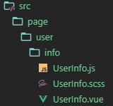

# origin
## 安装
`$ npm install origin-vue -g`

## 使用

````
Usage: ov [options] [entry]

快速创建vue的页面级组件和组件级组件

Options:

  -V, --version      output the version number
  -c, --comp         创建一个组件
  -n, --name <lang>  定义组件或页面的名称
  -p, --page         创建一个页面
  -s, --src <lang>   指定一个路径
  -h, --help         output usage information

````
## 警告
> 在创建组件之前，会将你原有文件删除！如你的组件名为`Info`，在执行命令后，将会先删除这个目录，再创建组件。
> 目前仅支持生成`scss`格式的样式文件。

### 创建页面级组件
使用 `-p` 指定为创建页面级组件，使用`-n` 为组件指定一个名称。
`$ ov -p -n 组件名`


### 创建组件级组件
使用 `-c` 指定为创建页面级组件，使用`-n` 为组件指定一个名称。
`$ ov -c -n 组件名`


### 为组件指定一个目录
默认是在当前目录创建组件，使用`-s` 为组件指定一个目录。
`$ ov -p -n UserInfo -s src/page/user/info`



## 开发计划
* 将会支持更多的CSS扩展语言。
* 将会支持更多的自定义配置。
